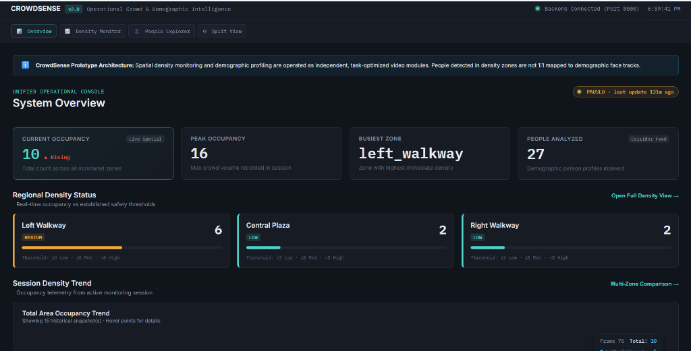
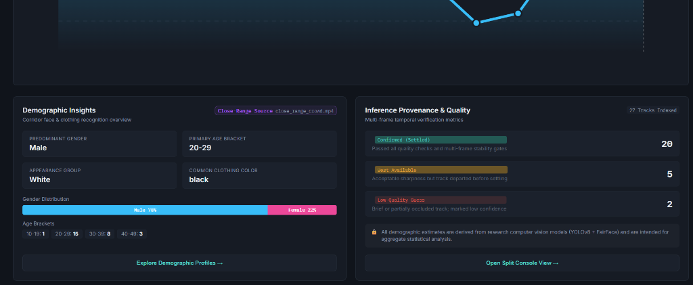
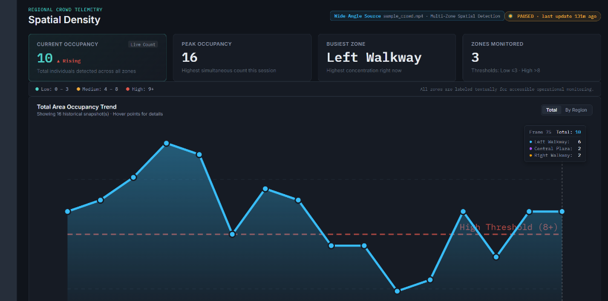
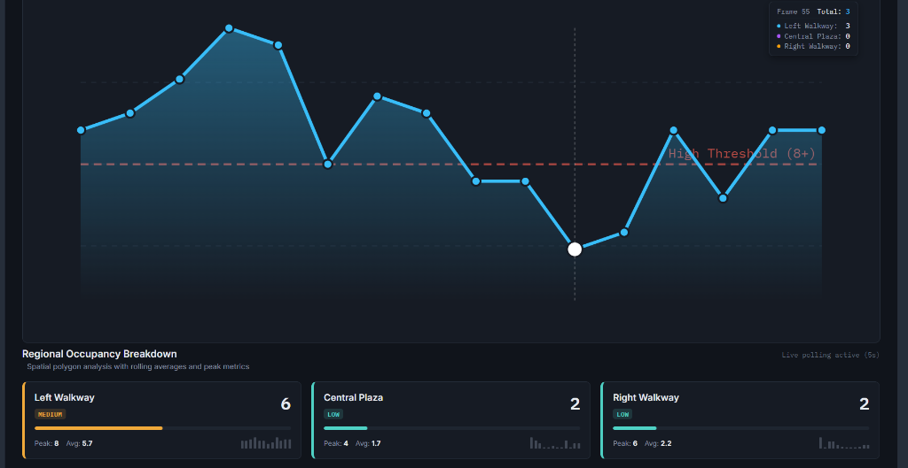
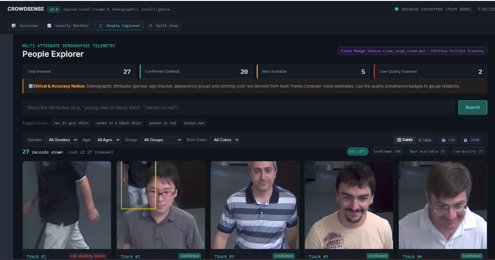
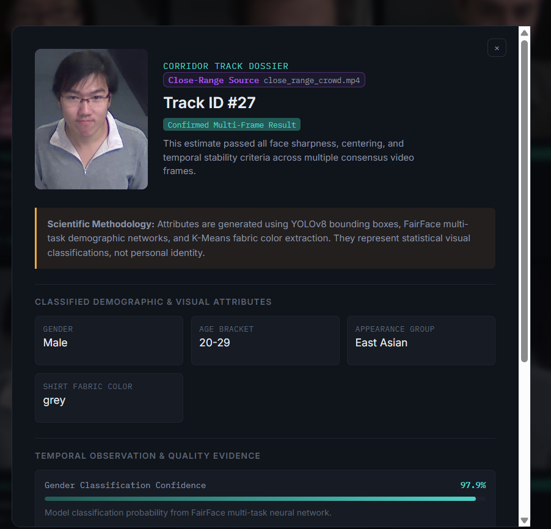
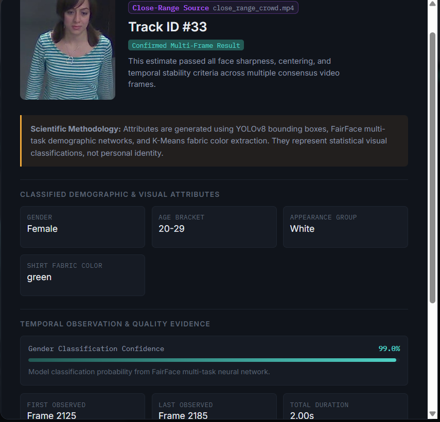
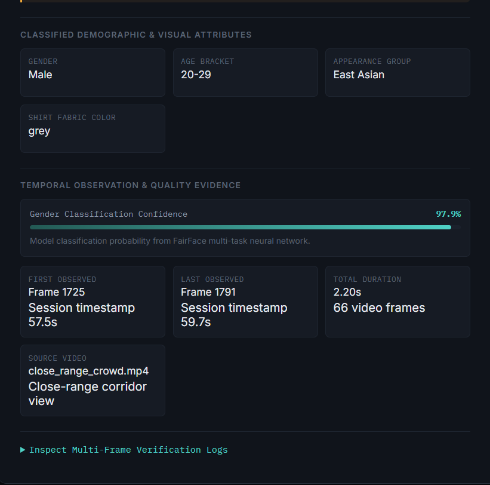
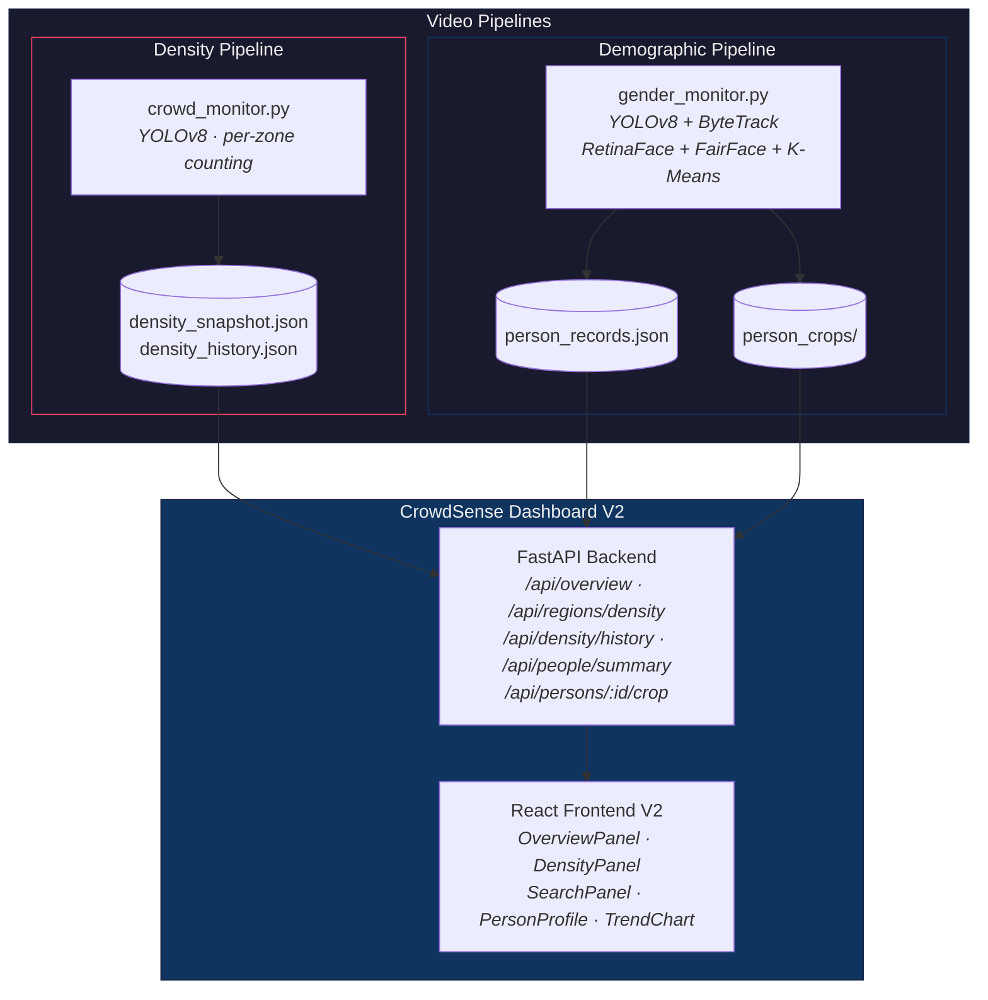

# AI-Based Regional Density Monitoring with Demographic Insights

[](https://www.python.org/)
[](LICENSE)
[](crowdsense-dashboard/frontend)
[](crowdsense-dashboard/backend)

> Real-time, per-zone crowd density monitoring with close-range demographic attribute detection and a live operational dashboard — built with YOLOv8, FairFace, React, and FastAPI.

---

## Table of Contents

- [Overview](#overview)
- [Architecture](#architecture)
- [Features](#features)
- [Tech Stack](#tech-stack)
- [Getting Started](#getting-started)
- [Usage](#usage)
- [Project Structure](#project-structure)
- [Testing](#testing)
- [Known Limitations](#known-limitations)
- [Research References](#research-references)
- [License](#license)

---

## Overview

This project provides two independent video-analysis pipelines and a unified web dashboard for crowd monitoring:

| Pipeline | What it does | Input |
|----------|-------------|-------|
| **Density Monitor** | Counts people per user-defined polygon zone, classifies density as LOW / MEDIUM / HIGH | Wide-angle crowd footage |
| **Demographic Monitor** | Tracks individuals, estimates gender, age range, and appearance group via FairFace | Close-range footage |
| **CrowdSense Dashboard** | Live web UI — density trends, person search, per-record evidence profiles | Reads from both pipelines |

---

## Product Showcase & Live V2 Screenshots

### 🖥️ 1. Unified Operational Overview
Executive operations console displaying real-time occupancy metrics, dynamic busiest zone telemetry, regional status bars, and persistent session trend preview.



### 📊 2. Spatial Density Monitoring V2
Real-time per-zone occupancy tracking across user-defined polygon regions with interactive SVG trend chart, danger threshold alerts (8+), and multi-zone rolling sparkline telemetry.



### 👤 3. People Explorer V2 & Multi-Attribute Search
Full demographic research explorer with natural language search, multi-attribute dropdown filters (Gender, Age, Appearance Group, Shirt Color), 1:1 bust crops, Cards/Table toggle, and one-click CSV/JSON dataset export.


### 🔍 4. Person Evidence Dossiers & Provenance Verification
Clickable forensic dossiers showing uncropped bust images, FairFace model confidence scores, observation timelines (frames & duration), and multi-frame verification logs.
| Track #27 (East Asian Male, 20–29, Grey Shirt) | Track #33 (White Female, 20–29, Green Shirt) |
|---|---|
|  |  |



---

## Architecture



---

## Features

### 🔍 Density Monitoring
- User-defined polygon regions via interactive GUI (`select_regions.py`)
- Per-zone person count with LOW / MEDIUM / HIGH density classification
- Live `density_snapshot.json` written every 5 frames for dashboard consumption

### 👤 Demographic Detection
- Per-person tracking with persistent IDs (within a single run)
- FairFace-based gender, age range, and appearance group estimation
- Confidence-weighted temporal smoothing — labels settle over ~2 seconds before locking
- Quality gating: blurry or non-frontal crops rejected before prediction
- Incremental saves every 500 frames + crash-safe `atexit` handler
- Smart crop selection: minimum bbox size, continuous upgrade to best available frame

### 📊 CrowdSense Dashboard V2
- **Overview landing console** — Executive operations dashboard with explicit pipeline status (`Live` / `Run completed` / `Paused`), 4 hero KPIs, multi-zone status cards, session trend preview, and demographic distribution bars.
- **Spatial density monitor V2** — Multi-zone interactive SVG trend chart with Total vs. By Region comparison, interactive frame tooltips, danger threshold lines, directional trend indicators (`Rising ▲` / `Falling ▼` / `Stable ▬`), and rolling sparklines.
- **People explorer V2** — Natural language query parsing, multi-attribute dropdown filters (Gender, Age, Appearance Group, Shirt Color), Cards vs. Table view toggle, and one-click `📥 CSV` / `📥 JSON` dataset export.
- **Evidence dossiers** — Forensic inspection modals displaying uncropped 1:1 bust crops, FairFace confidence bars, observation windows in frames and seconds, task-optimized source video attribution, and multi-frame verification logs.
- **Disambiguated split view** — Side-by-side operations console with independent module source labels (`sample_crowd.mp4` vs. `close_range_crowd.mp4`) and quick navigation links.

### 🔬 Research-Backed UI Design
- [IBM Carbon](https://carbondesignsystem.com/data-visualization/dashboards/) — KPI hierarchy and threshold annotations
- [Google SRE](https://sre.google/workbook/monitoring/) — Operational status states and data freshness
- [NIST AI RMF](https://doi.org/10.6028/NIST.AI.100-1) — AI transparency and honest uncertainty display
- [WCAG 2.2](https://www.w3.org/TR/WCAG22/) — Accessible data visualization (color + text + icons)

---

## Tech Stack

| Component | Used for |
|-----------|----------|
| [Ultralytics YOLOv8n](https://github.com/ultralytics/ultralytics) | Person detection + multi-object tracking (ByteTrack) |
| [OpenCV](https://opencv.org/) | Video I/O, region drawing, visualization |
| [FairFace](https://github.com/dchen236/FairFace) (ONNX) | Gender / age / appearance group prediction |
| [RetinaFace](https://github.com/yakhyo/uniface) (via `uniface`) | Face detection + landmark alignment |
| [FastAPI](https://fastapi.tiangolo.com/) | Dashboard REST API backend |
| [React 18](https://react.dev/) + [Vite](https://vite.dev/) | Dashboard frontend |

---

## Getting Started

### System Requirements

| Requirement | Minimum | Tested with |
|-------------|---------|------------|
| **OS** | Windows 10, Ubuntu 22.04+, or macOS 13+ | Windows 11 |
| **Python** | 3.10+ | 3.13.5 |
| **Node.js** | 18+ | 24.20.0 |
| **RAM** | 8 GB | — |
| **GPU** | Optional (NVIDIA CUDA recommended) | CPU-only works |

### Step 1 — Clone and create a virtual environment

```bash
git clone https://github.com/Enternatus/AI-Based-Regional-Density-Monitoring-with-Demographic-Insights.git
cd AI-Based-Regional-Density-Monitoring-with-Demographic-Insights

python -m venv venv
```

**Activate the environment:**

| OS | Command |
|----|---------|
| Windows (PowerShell) | `venv\Scripts\Activate.ps1` |
| Windows (cmd) | `venv\Scripts\activate.bat` |
| Linux / macOS | `source venv/bin/activate` |

### Step 2 — Install Python dependencies

**CPU-only (any machine):**
```bash
pip install torch==2.13.0 torchvision==0.28.0 --index-url https://download.pytorch.org/whl/cpu
pip install -r requirements.txt
```

**NVIDIA GPU (CUDA 12.x):**
```bash
pip install torch==2.13.0 torchvision==0.28.0 --index-url https://download.pytorch.org/whl/cu124
pip install -r requirements.txt
```

> [!NOTE]
> PyTorch must be installed **before** `requirements.txt` so the correct CPU/CUDA build is used. Running `pip install -r requirements.txt` alone defaults to CPU.

### Step 3 — Install dashboard frontend

```bash
cd crowdsense-dashboard/frontend
npm install
cd ../..
```

### Step 4 — Download model weights

| Weight | Location | How to get |
|--------|----------|------------|
| YOLOv8n | `yolov8n.pt` (auto-downloads) | Automatic on first run via `ultralytics` |
| FairFace ONNX | `fairface_model/weights/fairface.onnx` | See [docs/WEIGHTS.md](docs/WEIGHTS.md) for download link |

> [!IMPORTANT]
> `gender_monitor.py` will not run without the FairFace ONNX file. `crowd_monitor.py` only needs YOLOv8 (auto-downloads).

### Verify installation

```bash
python test_gender_monitor.py        # Should print: 17 passed, 0 failed
python -c "import torch; print(f'PyTorch {torch.__version__}, CUDA: {torch.cuda.is_available()}')"
```

---

## Usage

### 1. Define density regions (once per camera angle)

```bash
python scripts/select_regions.py
```

Left-click to add polygon points, `n` to name a region, `q` to finish → produces `regions.json`.

### 2. Run density monitoring

```bash
python crowd_monitor.py
```

### 3. Run demographic attribute detection

```bash
python gender_monitor.py
```

### 4. Launch the dashboard

```bash
# Terminal 1 — API
cd crowdsense-dashboard/backend
uvicorn main:app --reload --port 8000

# Terminal 2 — Frontend
cd crowdsense-dashboard/frontend
npm run dev
```

Open **http://localhost:5173**. See the [dashboard README](crowdsense-dashboard/README.md) for API docs and connection details.

### 5. Search people (CLI alternative)

```bash
python scripts/search_person.py
```

---

## Project Structure

```
.
├── crowd_monitor.py                  # Density pipeline — per-zone person counting
├── gender_monitor.py                 # Demographic pipeline — FairFace attributes
├── unsettled_fallback.py             # Fallback for tracks that never settled
├── test_gender_monitor.py            # 17 regression tests
├── regions.json                      # Zone polygon definitions
├── requirements.txt
│
├── crowdsense-dashboard/             # Web dashboard
│   ├── backend/                      #   FastAPI — search, density, person endpoints
│   └── frontend/                     #   React + Vite — DensityPanel, SearchPanel, PersonProfile
│
├── fairface_model/                   # FairFace ONNX predictor + model definitions
│   ├── models/                       #   predictor.py, fairface.py
│   └── weights/                      #   Place fairface.onnx here
│
├── attribute_recognition/            # Experimental clothing attribute recognition
├── scripts/                          # Utilities (region selection, person search, video tools)
├── debug/                            # Development/debug scripts
└── docs/                             # Model weight instructions
```

---

## Testing

```bash
python test_gender_monitor.py
```

17 regression tests covering attribute smoothing, confidence gating, quality rejection, fallback logic, and cross-run record isolation.

---

## Known Limitations

| Limitation | Detail |
|-----------|--------|
| **Separate videos** | Density and demographics use different footage — they do not share track IDs |
| **Per-run IDs only** | Tracker resets each execution; no cross-session re-identification |
| **Attribute accuracy** | FairFace outputs are model estimates, not verified facts. Accuracy degrades on small/angled/blurred crops |
| **Race classification** | Error rates vary by demographic group ([Gender Shades, 2018](https://proceedings.mlr.press/v81/buolamwini18a.html)). Confidence gating rejects uncertain reads |

---

## Engineering Deep-Dive: Color Constancy & Camera Perspective Geometry

### 1. Illumination Invariance for Clothing Classification
Surveillance footage in indoor corridors often exhibits strong illuminant bias (such as cool-white/blue fluorescent or warm tungsten lighting). Naive RGB distance metrics or simple thresholding misclassify dark or neutral fabrics as green or blue under cool illuminants.
* **Torso ROI Isolation:** In close-range head-and-shoulder views, naive middle-third sampling captures the face and neck. The pipeline isolates the lower 30% (`0.70h` to `0.98h`) where clothing fabric resides.
* **Multi-Cluster Separation:** A 2-cluster K-Means algorithm separates foreground clothing fabric from skin tone, necklines, and background shadows.
* **Pattern & Stripe Detection:** Row-by-row brightness variance analysis (`std(row_means)`) dynamically identifies high-contrast horizontal striped garments (e.g. black-and-white striped polos).
* **Future Work:** Offline background illuminant calibration and LAB color-space `(a*, b*)` chromatic clustering for zero-shot lighting invariance across varying facilities.

### 2. Monocular Height Estimation vs. Perspective Geometry
A single perspective surveillance camera cannot determine physical human stature from raw 2D bounding box heights, because bounding box pixel height is primarily a function of proximity to the lens (foreshortening).
* **Current Solution:** In close-up bust framing where feet/ankles are not visible, pseudo-height metrics are deliberately omitted to preserve scientific integrity and prevent misleading classifications.
* **Roadmap for Full-Body Feeds:** When foot-ground contact is visible, physical height can be calculated via:
  $$\mathbf{H}_{\text{ground}}: \mathbf{x}_{\text{image}} \mapsto \mathbf{X}_{\text{world}}$$
  combining a calibrated 4-point ground-plane homography with YOLOv8-pose keypoint vectors (head-to-ankle vertical projection).

---

## Research References

| Source | Applied to |
|--------|-----------|
| [IBM Carbon — Dashboards](https://carbondesignsystem.com/data-visualization/dashboards/) | KPI hierarchy, threshold annotations |
| [Google SRE — Monitoring](https://sre.google/workbook/monitoring/) | Operational status states, data freshness |
| [NIST AI RMF 1.0](https://doi.org/10.6028/NIST.AI.100-1) | AI transparency, "model estimate" labeling |
| [NIST FATE — Age Estimation](https://doi.org/10.6028/NIST.IR.8525) | Age as estimate, not fact |
| [WCAG 2.2](https://www.w3.org/TR/WCAG22/) | Accessible visualization (color + text + icons) |
| [Gender Shades (FAT* 2018)](https://proceedings.mlr.press/v81/buolamwini18a.html) | Honest confidence display |

---

## Troubleshooting

<details>
<summary><b>PyTorch uses CPU instead of GPU</b></summary>
Ensure you installed the CUDA-specific PyTorch wheels <b>before</b> running <code>pip install -r requirements.txt</code>. See Step 2 in the installation guide.
</details>

<details>
<summary><b>FileNotFoundError: fairface.onnx</b></summary>
The <code>gender_monitor.py</code> script requires the FairFace weights. Ensure you placed them exactly at <code>fairface_model/weights/fairface.onnx</code>. See <a href="docs/WEIGHTS.md">docs/WEIGHTS.md</a>.
</details>

<details>
<summary><b>Port 8000 or 5173 already in use</b></summary>
Kill the existing processes holding those ports. If you must change them, remember to update <code>BASE_URL</code> in <code>crowdsense-dashboard/frontend/src/api.js</code> if you change the backend port.
</details>

<details>
<summary><b>PowerShell: venv\Scripts\Activate.ps1 cannot be loaded</b></summary>
Open PowerShell as Administrator and run <code>Set-ExecutionPolicy -ExecutionPolicy RemoteSigned -Scope CurrentUser</code>, then try activating again.
</details>

<details>
<summary><b>OpenCV window freezes or doesn't appear</b></summary>
Run the scripts in a standard terminal (Command Prompt, PowerShell, or macOS/Linux Terminal), not inside an IDE's restricted internal console.
</details>

---

## License

MIT — see [LICENSE](LICENSE).
