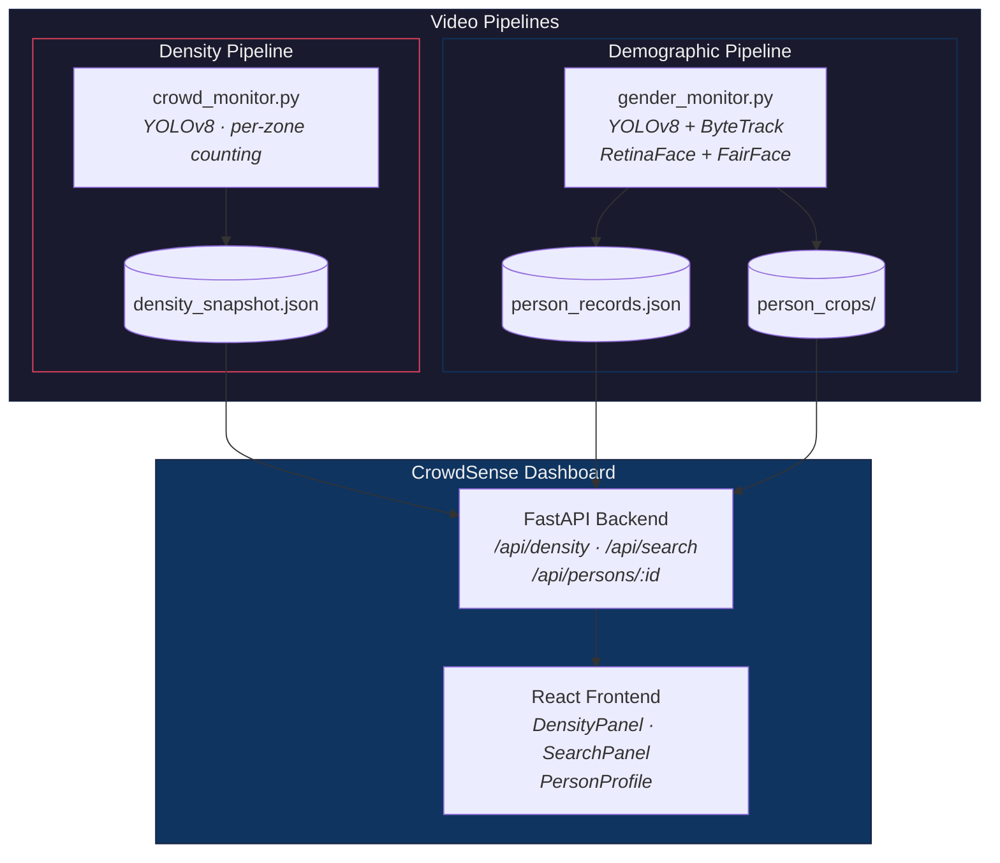

# AI-Based Regional Density Monitoring with Demographic Insights

[](https://www.python.org/)
[](LICENSE)
[](crowdsense-dashboard/frontend)
[](crowdsense-dashboard/backend)

> Real-time, per-zone crowd density monitoring with close-range demographic attribute detection and a live operational dashboard — built with YOLOv8, FairFace, React, and FastAPI.

---

## Table of Contents

- [Overview](#overview)
- [Architecture](#architecture)
- [Features](#features)
- [Tech Stack](#tech-stack)
- [Getting Started](#getting-started)
- [Usage](#usage)
- [Project Structure](#project-structure)
- [Testing](#testing)
- [Known Limitations](#known-limitations)
- [Research References](#research-references)
- [License](#license)

---

## Overview

This project provides two independent video-analysis pipelines and a unified web dashboard for crowd monitoring:

| Pipeline | What it does | Input |
|----------|-------------|-------|
| **Density Monitor** | Counts people per user-defined polygon zone, classifies density as LOW / MEDIUM / HIGH | Wide-angle crowd footage |
| **Demographic Monitor** | Tracks individuals, estimates gender, age range, and appearance group via FairFace | Close-range footage |
| **CrowdSense Dashboard** | Live web UI — density trends, person search, per-record evidence profiles | Reads from both pipelines |

---

## Architecture



---

## Features

### 🔍 Density Monitoring
- User-defined polygon regions via interactive GUI (`select_regions.py`)
- Per-zone person count with LOW / MEDIUM / HIGH density classification
- Live `density_snapshot.json` written every 5 frames for dashboard consumption

### 👤 Demographic Detection
- Per-person tracking with persistent IDs (within a single run)
- FairFace-based gender, age range, and appearance group estimation
- Confidence-weighted temporal smoothing — labels settle over ~2 seconds before locking
- Quality gating: blurry or non-frontal crops rejected before prediction
- Incremental saves every 500 frames + crash-safe `atexit` handler
- Smart crop selection: minimum bbox size, continuous upgrade to best available frame

### 📊 CrowdSense Dashboard
- **Split / Density / People** view modes for flexible presentation
- **Density panel** — live trend chart with annotated HIGH threshold line, per-region sparklines, peak tracking, smart status states (`Live` / `Run stopped` / `Video complete`)
- **People search** — free-text attribute search (e.g., *"tall young man in a red shirt"*), quality filter tabs (Confirmed / Best available / Low-quality guess)
- **Person profiles** — clickable evidence modal with all attributes labeled as model estimates, confidence bar, detection timeline, and raw attempt history

### 🔬 Research-Backed UI Design
- [IBM Carbon](https://carbondesignsystem.com/data-visualization/dashboards/) — KPI hierarchy and threshold annotations
- [Google SRE](https://sre.google/workbook/monitoring/) — Operational status states and data freshness
- [NIST AI RMF](https://doi.org/10.6028/NIST.AI.100-1) — AI transparency and honest uncertainty display
- [WCAG 2.2](https://www.w3.org/TR/WCAG22/) — Accessible data visualization (color + text + icons)

---

## Tech Stack

| Component | Used for |
|-----------|----------|
| [Ultralytics YOLOv8n](https://github.com/ultralytics/ultralytics) | Person detection + multi-object tracking (ByteTrack) |
| [OpenCV](https://opencv.org/) | Video I/O, region drawing, visualization |
| [FairFace](https://github.com/dchen236/FairFace) (ONNX) | Gender / age / appearance group prediction |
| [RetinaFace](https://github.com/yakhyo/uniface) (via `uniface`) | Face detection + landmark alignment |
| [FastAPI](https://fastapi.tiangolo.com/) | Dashboard REST API backend |
| [React 18](https://react.dev/) + [Vite](https://vite.dev/) | Dashboard frontend |

---

## Getting Started

### Prerequisites

- Python 3.9+
- Node.js 18+ and npm
- CUDA-capable GPU recommended (not required)

### Installation

```bash
# Clone
git clone https://github.com/Enternatus/AI-Based-Regional-Density-Monitoring-with-Demographic-Insights.git
cd AI-Based-Regional-Density-Monitoring-with-Demographic-Insights

# Python environment
python -m venv venv
venv\Scripts\activate          # Linux/macOS: source venv/bin/activate
pip install -r requirements.txt

# Dashboard frontend
cd crowdsense-dashboard/frontend
npm install
cd ../..
```

### Model Weights

| Weight | Location | How to get |
|--------|----------|------------|
| YOLOv8n | Auto-downloads | Via `ultralytics` on first run |
| FairFace ONNX | `fairface_model/weights/fairface.onnx` | See [docs/WEIGHTS.md](docs/WEIGHTS.md) |

---

## Usage

### 1. Define density regions (once per camera angle)

```bash
python scripts/select_regions.py
```

Left-click to add polygon points, `n` to name a region, `q` to finish → produces `regions.json`.

### 2. Run density monitoring

```bash
python crowd_monitor.py
```

### 3. Run demographic attribute detection

```bash
python gender_monitor.py
```

### 4. Launch the dashboard

```bash
# Terminal 1 — API
cd crowdsense-dashboard/backend
uvicorn main:app --reload --port 8000

# Terminal 2 — Frontend
cd crowdsense-dashboard/frontend
npm run dev
```

Open **http://localhost:5173**. See the [dashboard README](crowdsense-dashboard/README.md) for API docs and connection details.

### 5. Search people (CLI alternative)

```bash
python scripts/search_person.py
```

---

## Project Structure

```
.
├── crowd_monitor.py                  # Density pipeline — per-zone person counting
├── gender_monitor.py                 # Demographic pipeline — FairFace attributes
├── unsettled_fallback.py             # Fallback for tracks that never settled
├── test_gender_monitor.py            # 17 regression tests
├── regions.json                      # Zone polygon definitions
├── requirements.txt
│
├── crowdsense-dashboard/             # Web dashboard
│   ├── backend/                      #   FastAPI — search, density, person endpoints
│   └── frontend/                     #   React + Vite — DensityPanel, SearchPanel, PersonProfile
│
├── fairface_model/                   # FairFace ONNX predictor + model definitions
│   ├── models/                       #   predictor.py, fairface.py
│   └── weights/                      #   Place fairface.onnx here
│
├── attribute_recognition/            # Experimental clothing attribute recognition
├── scripts/                          # Utilities (region selection, person search, video tools)
├── debug/                            # Development/debug scripts
└── docs/                             # Model weight instructions
```

---

## Testing

```bash
python test_gender_monitor.py
```

17 regression tests covering attribute smoothing, confidence gating, quality rejection, fallback logic, and cross-run record isolation.

---

## Known Limitations

| Limitation | Detail |
|-----------|--------|
| **Separate videos** | Density and demographics use different footage — they do not share track IDs |
| **Per-run IDs only** | Tracker resets each execution; no cross-session re-identification |
| **Attribute accuracy** | FairFace outputs are model estimates, not verified facts. Accuracy degrades on small/angled/blurred crops |
| **Race classification** | Error rates vary by demographic group ([Gender Shades, 2018](https://proceedings.mlr.press/v81/buolamwini18a.html)). Confidence gating rejects uncertain reads |

---

## Research References

| Source | Applied to |
|--------|-----------|
| [IBM Carbon — Dashboards](https://carbondesignsystem.com/data-visualization/dashboards/) | KPI hierarchy, threshold annotations |
| [Google SRE — Monitoring](https://sre.google/workbook/monitoring/) | Operational status states, data freshness |
| [NIST AI RMF 1.0](https://doi.org/10.6028/NIST.AI.100-1) | AI transparency, "model estimate" labeling |
| [NIST FATE — Age Estimation](https://doi.org/10.6028/NIST.IR.8525) | Age as estimate, not fact |
| [WCAG 2.2](https://www.w3.org/TR/WCAG22/) | Accessible visualization (color + text + icons) |
| [Gender Shades (FAT* 2018)](https://proceedings.mlr.press/v81/buolamwini18a.html) | Honest confidence display |

---

## License

MIT — see [LICENSE](LICENSE).
