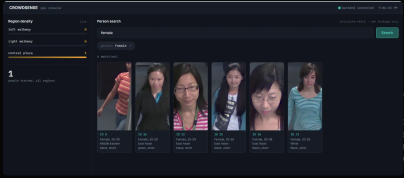
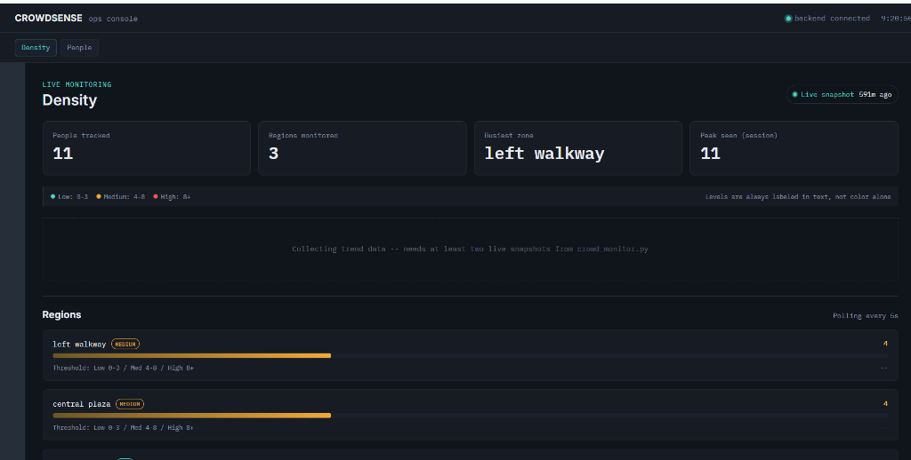
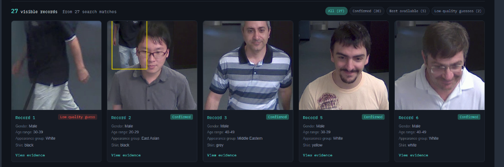
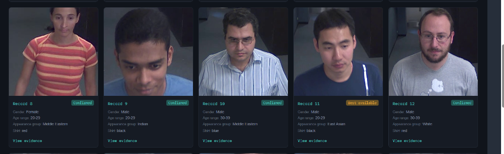
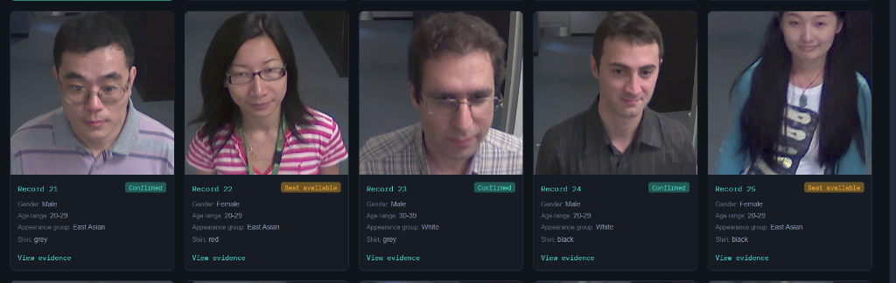
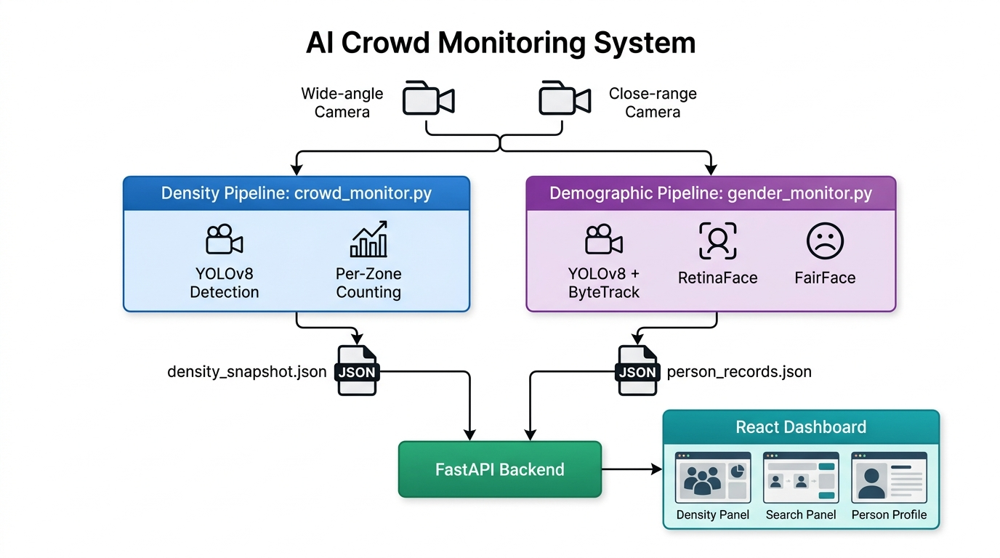

# CrowdSense - Product Demo & Showcase

Visual demonstration materials for the **AI-Based Regional Density & Demographic Monitoring System**.

---

## 🖥️ Operational Console (Split View)
Integrated operational console providing simultaneous situational awareness: live regional density telemetry on the left, and real-time demographic person tracking on the right.

---

## 📊 Live Regional Density Monitoring
Sub-second per-zone occupancy tracking across user-defined polygon regions (Left Walkway, Central Plaza, Right Walkway) with automated congestion threshold alerts and historical trend telemetry.

---

## 👤 Demographic Analysis & Semantic Search
Natural language querying and attribute filtering (gender, age bracket, appearance group, clothing color) with unchopped, high-resolution representative bust crops.

---

## 🏗️ System Architecture
Dual-pipeline video analysis powered by YOLOv8, ByteTrack, RetinaFace, FairFace, FastAPI, and React.

