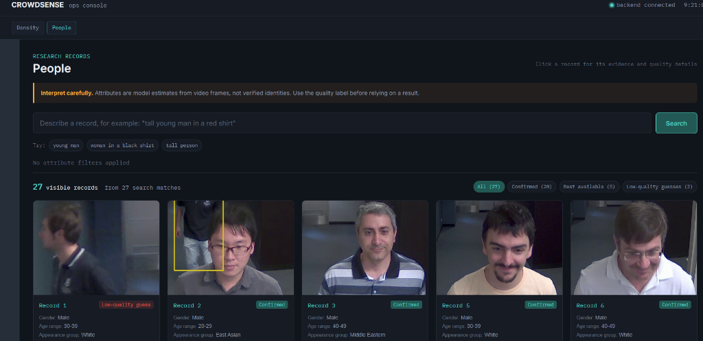

# CrowdSense - Product Demo

Welcome to the visual presentation materials for the AI-Based Regional Density & Demographic Monitoring system.

## System Architecture
Real-time processing pipeline utilizing YOLOv8, FairFace, and FastAPI.

  

## Live Density Monitoring
Track crowd thresholds across multiple predefined regions dynamically.

  

## Demographic Analysis & Semantic Search
Filter person records using natural language and demographic tags.

  

## Unified Dashboard (Split View)
Integrated operational console for real-time situational awareness.

